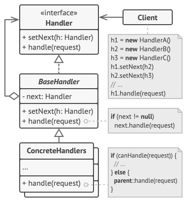

# Chain of Responsiblity (CoR, Chain of Command)

Chain of Responsibility is a behavioral design pattern that lets you pass requests along a chain of handlers. Upon receiving a request, each handler decides either to process the request or to pass it to the next handler in the chain.

## Structure

1. The Handler declares the interface, common for all concrete handlers. It usually contains just a single method for handling requests, but sometimes it may also have another method for setting the next handler on the chain.
2. The Base Handler is an optional class where you can put the boilerplate code that’s common to all handler classes.

    Usually, this class defines a field for storing a reference to the next handler. The clients can build a chain by passing a handler to the constructor or setter of the previous handler. The class may also implement the default handling behavior: it can pass execution to the next handler after checking for its existence.

3. Concrete Handlers contain the actual code for processing requests. Upon receiving a request, each handler must decide whether to process it and, additionally, whether to pass it along the chain.

    Handlers are usually self-contained and immutable, accepting all necessary data just once via the constructor.

4. The Client may compose chains just once or compose them dynamically, depending on the application’s logic. Note that a request can be sent to any handler in the chain—it doesn’t have to be the first one.

## Applicability

1. **Use the Chain of Responsibility pattern when your program is expected to process different kinds of requests in various ways, but the exact types of requests and their sequences are unknown beforehand.**

    The pattern lets you link several handlers into one chain and, upon receiving a request, “ask” each handler whether it can process it. This way all handlers get a chance to process the request.

2. **Use the pattern when it’s essential to execute several handlers in a particular order.**

    Since you can link the handlers in the chain in any order, all requests will get through the chain exactly as you planned.

3. **Use the CoR pattern when the set of handlers and their order are supposed to change at runtime.**

    If you provide setters for a reference field inside the handler classes, you’ll be able to insert, remove or reorder handlers dynamically.

## Pros & Cons

| Pros                                                                                                                   | Cons                                |
| ---------------------------------------------------------------------------------------------------------------------- | ----------------------------------- |
| You can control the order of request handling.                                                                         | Some requests may end up unhandled. |
| Single Responsibility Principle. You can decouple classes that invoke operations from classes that perform operations. |                                     |
| Open/Closed Principle. You can introduce new handlers into the app without breaking the existing client code.          |                                     |