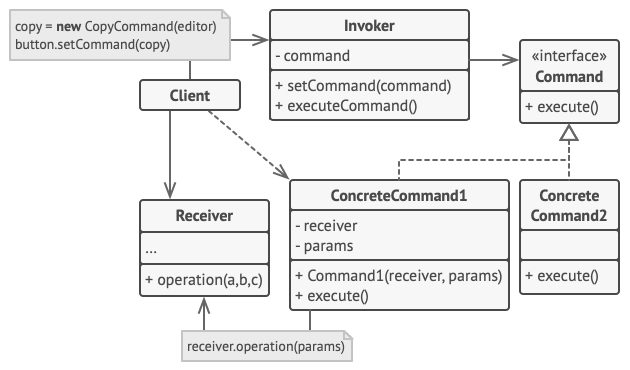

# Command (Action, Transaction)

Command is a behavioral design pattern that turns a request into a stand-alone object that contains all information about the request. This transformation lets you pass requests as a method arguments, delay or queue a request’s execution, and support undoable operations.

**Complexity:** ★☆☆

**Popularity:** ★★★

## Structure

1. The Sender class (aka invoker) is responsible for initiating requests. This class must have a field for storing a reference to a command object. The sender triggers that command instead of sending the request directly to the receiver. Note that the sender isn’t responsible for creating the command object. Usually, it gets a pre-created command from the client via the constructor.
2. The Command interface usually declares just a single method for executing the command.
3. Concrete Commands implement various kinds of requests. A concrete command isn’t supposed to perform the work on its own, but rather to pass the call to one of the business logic objects. However, for the sake of simplifying the code, these classes can be merged.

    Parameters required to execute a method on a receiving object can be declared as fields in the concrete command. You can make command objects immutable by only allowing the initialization of these fields via the constructor.

4. The Receiver class contains some business logic. Almost any object may act as a receiver. Most commands only handle the details of how a request is passed to the receiver, while the receiver itself does the actual work.
5. The Client creates and configures concrete command objects. The client must pass all of the request parameters, including a receiver instance, into the command’s constructor. After that, the resulting command may be associated with one or multiple senders.

## Applicability

1. **Use the Command pattern when you want to parametrize objects with operations.**

    The Command pattern can turn a specific method call into a stand-alone object. This change opens up a lot of interesting uses: you can pass commands as method arguments, store them inside other objects, switch linked commands at runtime, etc.

    Here’s an example: you’re developing a GUI component such as a context menu, and you want your users to be able to configure menu items that trigger operations when an end user clicks an item.

2. **Use the Command pattern when you want to queue operations, schedule their execution, or execute them remotely.**

    As with any other object, a command can be serialized, which means converting it to a string that can be easily written to a file or a database. Later, the string can be restored as the initial command object. Thus, you can delay and schedule command execution. But there’s even more! In the same way, you can queue, log or send commands over the network.

3. **Use the Command pattern when you want to implement reversible operations.**

    Although there are many ways to implement undo/redo, the Command pattern is perhaps the most popular of all.

    To be able to revert operations, you need to implement the history of performed operations. The command history is a stack that contains all executed command objects along with related backups of the application’s state.

    This method has two drawbacks. First, it isn’t that easy to save an application’s state because some of it can be private. This problem can be mitigated with the Memento pattern.

    Second, the state backups may consume quite a lot of RAM. Therefore, sometimes you can resort to an alternative implementation: instead of restoring the past state, the command performs the inverse operation. The reverse operation also has a price: it may turn out to be hard or even impossible to implement.

## Pros & Cons

| Pros                                                                                                                           | Cons                                                                                                           |
| ------------------------------------------------------------------------------------------------------------------------------ | -------------------------------------------------------------------------------------------------------------- |
| *Single Responsibility Principle*. You can decouple classes that invoke operations from classes that perform these operations. | The code may become more complicated since you’re introducing a whole new layer between senders and receivers. |
| *Open/Closed Principle*. You can introduce new commands into the app without breaking existing client code.                    |                                                                                                                |
| You can implement undo/redo.                                                                                                   |                                                                                                                |
| You can implement deferred execution of operations.                                                                            |                                                                                                                |
| You can assemble a set of simple commands into a complex one.                                                                  |                                                                                                                |