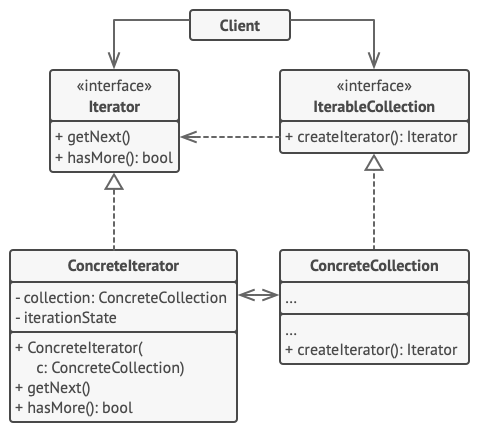

# Iterator

Iterator is a behavioral design pattern that lets you traverse elements of a collection without exposing its underlying representation (list, stack, tree, etc.).

**Complexity:** ★★☆

**Popularity:** ★★★

## Structure

1. The Iterator interface declares the operations required for traversing a collection: fetching the next element, retrieving the current position, restarting iteration, etc.
2. Concrete Iterators implement specific algorithms for traversing a collection. The iterator object should track the traversal progress on its own. This allows several iterators to traverse the same collection independently of each other.
3. The Collection interface declares one or multiple methods for getting iterators compatible with the collection. Note that the return type of the methods must be declared as the iterator interface so that the concrete collections can return various kinds of iterators.
4. Concrete Collections return new instances of a particular concrete iterator class each time the client requests one. You might be wondering, where’s the rest of the collection’s code? Don’t worry, it should be in the same class. It’s just that these details aren’t crucial to the actual pattern, so we’re omitting them.
5. The Client works with both collections and iterators via their interfaces. This way the client isn’t coupled to concrete classes, allowing you to use various collections and iterators with the same client code.

    Typically, clients don’t create iterators on their own, but instead get them from collections. Yet, in certain cases, the client can create one directly; for example, when the client defines its own special iterator.

## Applicability

1. **Use the Iterator pattern when your collection has a complex data structure under the hood, but you want to hide its complexity from clients (either for convenience or security reasons).**

    The iterator encapsulates the details of working with a complex data structure, providing the client with several simple methods of accessing the collection elements. While this approach is very convenient for the client, it also protects the collection from careless or malicious actions which the client would be able to perform if working with the collection directly.

2. **Use the pattern to reduce duplication of the traversal code across your app.**

    The code of non-trivial iteration algorithms tends to be very bulky. When placed within the business logic of an app, it may blur the responsibility of the original code and make it less maintainable. Moving the traversal code to designated iterators can help you make the code of the application more lean and clean.

3. **Use the Iterator when you want your code to be able to traverse different data structures or when types of these structures are unknown beforehand.**

    The pattern provides a couple of generic interfaces for both collections and iterators. Given that your code now uses these interfaces, it’ll still work if you pass it various kinds of collections and iterators that implement these interfaces.

## Pros & Cons

| Pros                                                                                                                                                  | Cons                                                                                                          |
| ----------------------------------------------------------------------------------------------------------------------------------------------------- | ------------------------------------------------------------------------------------------------------------- |
| Single Responsibility Principle. You can clean up the client code and the collections by extracting bulky traversal algorithms into separate classes. | Applying the pattern can be an overkill if your app only works with simple collections.                       |
| Open/Closed Principle. You can implement new types of collections and iterators and pass them to existing code without breaking anything.             | Using an iterator may be less efficient than going through elements of some specialized collections directly. |
| You can iterate over the same collection in parallel because each iterator object contains its own iteration state.                                   |                                                                                                               |
| For the same reason, you can delay an iteration and continue it when needed.                                                                          |                                                                                                               |