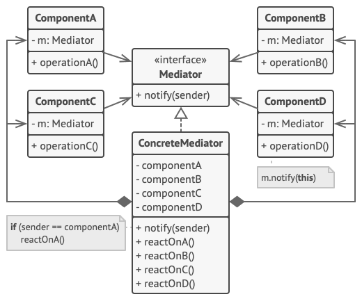

# Mediator (Controller, Intermediary)

Mediator is a behavioral design pattern that lets you reduce chaotic dependencies between objects. The pattern restricts direct communications between the objects and forces them to collaborate only via a mediator object.

**Complexity:** ★★☆

**Popularity:** ☆☆☆

## Structure

1. Components are various classes that contain some business logic. Each component has a reference to a mediator, declared with the type of the mediator interface. The component isn’t aware of the actual class of the mediator, so you can reuse the component in other programs by linking it to a different mediator.
2. The Mediator interface declares methods of communication with components, which usually include just a single notification method. Components may pass any context as arguments of this method, including their own objects, but only in such a way that no coupling occurs between a receiving component and the sender’s class.
3. Concrete Mediators encapsulate relations between various components. Concrete mediators often keep references to all components they manage and sometimes even manage their lifecycle.
4. Components must not be aware of other components. If something important happens within or to a component, it must only notify the mediator. When the mediator receives the notification, it can easily identify the sender, which might be just enough to decide what component should be triggered in return.

    From a component’s perspective, it all looks like a total black box. The sender doesn’t know who’ll end up handling its request, and the receiver doesn’t know who sent the request in the first place.

## Applicability

1. **Use the Mediator pattern when it’s hard to change some of the classes because they are tightly coupled to a bunch of other classes.**

    The pattern lets you extract all the relationships between classes into a separate class, isolating any changes to a specific component from the rest of the components.

2. **Use the pattern when you can’t reuse a component in a different program because it’s too dependent on other components.**

    After you apply the Mediator, individual components become unaware of the other components. They could still communicate with each other, albeit indirectly, through a mediator object. To reuse a component in a different app, you need to provide it with a new mediator class.

3. **Use the Mediator when you find yourself creating tons of component subclasses just to reuse some basic behavior in various contexts.**

    Since all relations between components are contained within the mediator, it’s easy to define entirely new ways for these components to collaborate by introducing new mediator classes, without having to change the components themselves.

## Pros & Cons

| Pros                                                                                                                                                             | Cons                                               |
| ---------------------------------------------------------------------------------------------------------------------------------------------------------------- | -------------------------------------------------- |
| Single Responsibility Principle. You can extract the communications between various components into a single place, making it easier to comprehend and maintain. | Over time a mediator can evolve into a God Object. |
| Open/Closed Principle. You can introduce new mediators without having to change the actual components.                                                           |                                                    |
| You can reduce coupling between various components of a program.                                                                                                 |                                                    |
| You can reuse individual components more easily.                                                                                                                 |                                                    |