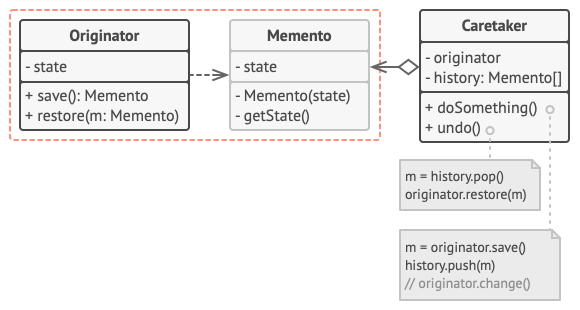
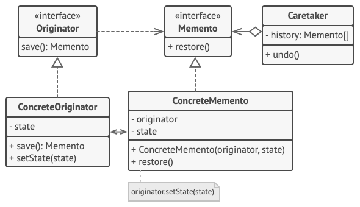

# Memento (Snapshot)

Memento is a behavioral design pattern that lets you save and restore the previous state of an object without revealing the details of its implementation.

**Complexity:** ★★★

**Popularity:** ★☆☆

## Structure

### Implementation based on nested classes

The classic implementation of the pattern relies on support for nested classes, available in many popular programming languages (such as C++, C#, and Java).

1. The Originator class can produce snapshots of its own state, as well as restore its state from snapshots when needed.
2. The Memento is a value object that acts as a snapshot of the originator’s state. It’s a common practice to make the memento immutable and pass it the data only once, via the constructor.
3. The Caretaker knows not only “when” and “why” to capture the originator’s state, but also when the state should be restored.

    A caretaker can keep track of the originator’s history by storing a stack of mementos. When the originator has to travel back in history, the caretaker fetches the topmost memento from the stack and passes it to the originator’s restoration method.

4. In this implementation, the memento class is nested inside the originator. This lets the originator access the fields and methods of the memento, even though they’re declared private. On the other hand, the caretaker has very limited access to the memento’s fields and methods, which lets it store mementos in a stack but not tamper with their state.

### Implementation based on an intermediate interface

There’s an alternative implementation, suitable for programming languages that don’t support nested classes (yeah, PHP, I’m talking about you).

1. In the absence of nested classes, you can restrict access to the memento’s fields by establishing a convention that caretakers can work with a memento only through an explicitly declared intermediary interface, which would only declare methods related to the memento’s metadata.
2. On the other hand, originators can work with a memento object directly, accessing fields and methods declared in the memento class. The downside of this approach is that you need to declare all members of the memento public.

### Implementation with even stricter encapsulation

There’s another implementation which is useful when you don’t want to leave even the slightest chance of other classes accessing the state of the originator through the memento.

1. This implementation allows having multiple types of originators and mementos. Each originator works with a corresponding memento class. Neither originators nor mementos expose their state to anyone.
2. Caretakers are now explicitly restricted from changing the state stored in mementos. Moreover, the caretaker class becomes independent from the originator because the restoration method is now defined in the memento class.
3. Each memento becomes linked to the originator that produced it. The originator passes itself to the memento’s constructor, along with the values of its state. Thanks to the close relationship between these classes, a memento can restore the state of its originator, given that the latter has defined the appropriate setters.

## Applicability

1. **Use the Memento pattern when you want to produce snapshots of the object’s state to be able to restore a previous state of the object.**

    The Memento pattern lets you make full copies of an object’s state, including private fields, and store them separately from the object. While most people remember this pattern thanks to the “undo” use case, it’s also indispensable when dealing with transactions (i.e., if you need to roll back an operation on error).

2. **Use the pattern when direct access to the object’s fields/getters/setters violates its encapsulation.**

    The Memento makes the object itself responsible for creating a snapshot of its state. No other object can read the snapshot, making the original object’s state data safe and secure.

## Pros & Cons

| Pros                                                                                                            | Cons                                                                                                                                       |
| --------------------------------------------------------------------------------------------------------------- | ------------------------------------------------------------------------------------------------------------------------------------------ |
| You can produce snapshots of the object’s state without violating its encapsulation.                            | The app might consume lots of RAM if clients create mementos too often.                                                                    |
| You can simplify the originator’s code by letting the caretaker maintain the history of the originator’s state. | Caretakers should track the originator’s lifecycle to be able to destroy obsolete mementos.                                                |
|                                                                                                                 | Most dynamic programming languages, such as PHP, Python and JavaScript, can’t guarantee that the state within the memento stays untouched. |