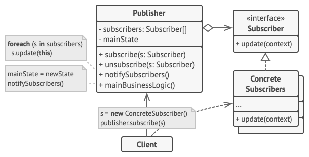

# Observer (Event-Subscriber, Listener)

Observer is a behavioral design pattern that lets you define a subscription mechanism to notify multiple objects about any events that happen to the object they’re observing.

**Complexity:** ★★☆

**Popularity:** ★★★

## Structure

1. The Publisher issues events of interest to other objects. These events occur when the publisher changes its state or executes some behaviors. Publishers contain a subscription infrastructure that lets new subscribers join and current subscribers leave the list.
2. When a new event happens, the publisher goes over the subscription list and calls the notification method declared in the subscriber interface on each subscriber object.
3. The Subscriber interface declares the notification interface. In most cases, it consists of a single update method. The method may have several parameters that let the publisher pass some event details along with the update.
4. Concrete Subscribers perform some actions in response to notifications issued by the publisher. All of these classes must implement the same interface so the publisher isn’t coupled to concrete classes.
5. Usually, subscribers need some contextual information to handle the update correctly. For this reason, publishers often pass some context data as arguments of the notification method. The publisher can pass itself as an argument, letting subscriber fetch any required data directly.
6. The Client creates publisher and subscriber objects separately and then registers subscribers for publisher updates.

## Applicability

1. Use the Observer pattern when changes to the state of one object may require changing other objects, and the actual set of objects is unknown beforehand or changes dynamically.

    You can often experience this problem when working with classes of the graphical user interface. For example, you created custom button classes, and you want to let the clients hook some custom code to your buttons so that it fires whenever a user presses a button.

    The Observer pattern lets any object that implements the subscriber interface subscribe for event notifications in publisher objects. You can add the subscription mechanism to your buttons, letting the clients hook up their custom code via custom subscriber classes.

2. Use the pattern when some objects in your app must observe others, but only for a limited time or in specific cases.

    The subscription list is dynamic, so subscribers can join or leave the list whenever they need to.

## Pros & Cons

| Pros                                                                                                                                                             | Cons                                      |
| ---------------------------------------------------------------------------------------------------------------------------------------------------------------- | ----------------------------------------- |
| Open/Closed Principle. You can introduce new subscriber classes without having to change the publisher’s code (and vice versa if there’s a publisher interface). | Subscribers are notified in random order. |
| You can establish relations between objects at runtime.                                                                                                          |                                           |