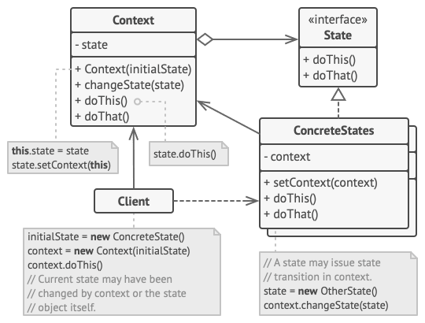

# State

State is a behavioral design pattern that lets an object alter its behavior when its internal state changes. It appears as if the object changed its class.

## Structure

1. Context stores a reference to one of the concrete state objects and delegates to it all state-specific work. The context communicates with the state object via the state interface. The context exposes a setter for passing it a new state object.
2. The State interface declares the state-specific methods. These methods should make sense for all concrete states because you don’t want some of your states to have useless methods that will never be called.
3. Concrete States provide their own implementations for the state-specific methods. To avoid duplication of similar code across multiple states, you may provide intermediate abstract classes that encapsulate some common behavior.

    State objects may store a backreference to the context object. Through this reference, the state can fetch any required info from the context object, as well as initiate state transitions.

4. Both context and concrete states can set the next state of the context and perform the actual state transition by replacing the state object linked to the context.

## Applicability

1. Use the State pattern when you have an object that behaves differently depending on its current state, the number of states is enormous, and the state-specific code changes frequently.

    The pattern suggests that you extract all state-specific code into a set of distinct classes. As a result, you can add new states or change existing ones independently of each other, reducing the maintenance cost.

2. Use the pattern when you have a class polluted with massive conditionals that alter how the class behaves according to the current values of the class’s fields.

    The State pattern lets you extract branches of these conditionals into methods of corresponding state classes. While doing so, you can also clean temporary fields and helper methods involved in state-specific code out of your main class.

3. Use State when you have a lot of duplicate code across similar states and transitions of a condition-based state machine.

    The State pattern lets you compose hierarchies of state classes and reduce duplication by extracting common code into abstract base classes.

## Pros & Cons

| Pros                                                                                                   | Cons                                                                                             |
| ------------------------------------------------------------------------------------------------------ | ------------------------------------------------------------------------------------------------ |
| Single Responsibility Principle. Organize the code related to particular states into separate classes. | Applying the pattern can be overkill if a state machine has only a few states or rarely changes. |
| Open/Closed Principle. Introduce new states without changing existing state classes or the context.    |                                                                                                  |
| Simplify the code of the context by eliminating bulky state machine conditionals.                      |                                                                                                  |