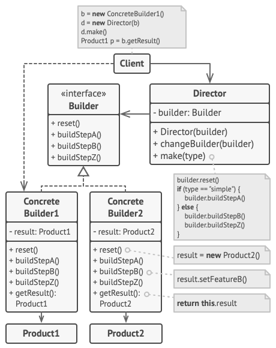

# Builder

Builder is a creational design pattern that lets you construct complex objects step by step. The pattern allows you to produce different types and representations of an object using the same construction code.

Unlike other creational patterns, Builder doesn’t require products to have a common interface. That makes it possible to produce different products using the same construction process.

**Complexity:** ★★☆
**Popularity:** ★★★

## Structure

1. The **Builder** interface declares product construction steps that are common to all types of builders.
2. **Concrete Builders** provide different implementations of the construction steps. Concrete builders may produce products that don’t follow the common interface.
3. **Products** are resulting objects. Products constructed by different builders don’t have to belong to the same class hierarchy or interface.
4. The **Director** class defines the order in which to call construction steps, so you can create and reuse specific configurations of products.
5. The **Client** must associate one of the builder objects with the director. Usually, it’s done just once, via parameters of the director’s constructor. Then the director uses that builder object for all further construction. However, there’s an alternative approach for when the client passes the builder object to the production method of the director. In this case, you can use a different builder each time you produce something with the director.

## Pros & Cons

| Pros                                                                                                                   | Cons                                                                                                   |
|------------------------------------------------------------------------------------------------------------------------|--------------------------------------------------------------------------------------------------------|
| You can construct objects step-by-step, defer construction steps or run steps recursively.                             | The overall complexity of the code increases since the pattern requires creating multiple new classes. |
| You can reuse the same construction code when building various representations of products.                            |                                                                                                        |
| _Single Responsibility Principle_. You can isolate complex construction code from the business logic of the product. |                                                                                                        |