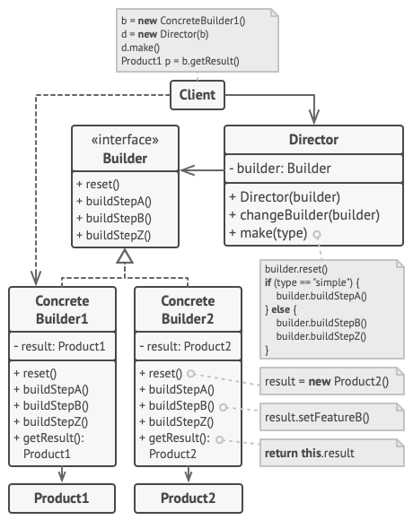

# Builder

Builder is a creational design pattern that lets you construct complex objects step by step. The pattern allows you to produce different types and representations of an object using the same construction code.

Unlike other creational patterns, Builder doesn’t require products to have a common interface. That makes it possible to produce different products using the same construction process.

**Complexity:** ★★☆ **Popularity:** ★★★

## Structure



1. The **Builder** interface declares product construction steps that are common to all types of builders.
2. **Concrete Builders** provide different implementations of the construction steps. Concrete builders may produce products that don’t follow the common interface.
3. **Products** are resulting objects. Products constructed by different builders don’t have to belong to the same class hierarchy or interface.
4. The **Director** class defines the order in which to call construction steps, so you can create and reuse specific configurations of products.
5. The **Client** must associate one of the builder objects with the director. Usually, it’s done just once, via parameters of the director’s constructor. Then the director uses that builder object for all further construction. However, there’s an alternative approach for when the client passes the builder object to the production method of the director. In this case, you can use a different builder each time you produce something with the director.

## Applicability

1.  **Use the Builder pattern to get rid of a “telescoping constructor”.**

    Say you have a constructor with ten optional parameters. Calling such a beast is very inconvenient; therefore, you overload the constructor and create several shorter versions with fewer parameters. These constructors still refer to the main one, passing some default values into any omitted parameters.

    ```java
    class Pizza {
        Pizza(int size) { ... }
        Pizza(int size, boolean cheese) { ... }
        Pizza(int size, boolean cheese, boolean pepperoni) { ... }
        // ...
    ```

    The Builder pattern lets you build objects step by step, using only those steps that you really need. After implementing the pattern, you don’t have to cram dozens of parameters into your constructors anymore.
2.  **Use the Builder pattern when you want your code to be able to create different representations of some product (for example, stone and wooden houses).**

    The Builder pattern can be applied when construction of various representations of the product involves similar steps that differ only in the details.

    The base builder interface defines all possible construction steps, and concrete builders implement these steps to construct particular representations of the product. Meanwhile, the director class guides the order of construction.
3.  **Use the Builder to construct Composite trees or other complex objects.**

    The Builder pattern lets you construct products step-by-step. You could defer execution of some steps without breaking the final product. You can even call steps recursively, which comes in handy when you need to build an object tree.

    A builder doesn’t expose the unfinished product while running construction steps. This prevents the client code from fetching an incomplete result.

## Pros & Cons

| Pros                                                                                                                 | Cons                                                                                                   |
| -------------------------------------------------------------------------------------------------------------------- | ------------------------------------------------------------------------------------------------------ |
| You can construct objects step-by-step, defer construction steps or run steps recursively.                           | The overall complexity of the code increases since the pattern requires creating multiple new classes. |
| You can reuse the same construction code when building various representations of products.                          |                                                                                                        |
| _Single Responsibility Principle_. You can isolate complex construction code from the business logic of the product. |                                                                                                        |
