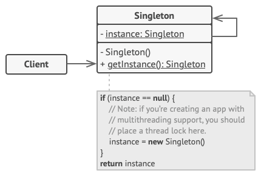

# Singleton

Singleton is a creational design pattern that lets you ensure that a class has only one instance, while providing a global access point to this instance.

**Complexity:** ★☆☆

**Popularity:** ★★☆

## Structure

The **Singleton** class declares the static method `getInstance` that returns the same instance of its own class.

The Singleton’s constructor should be hidden from the client code. Calling the `getInstance` method should be the only way of getting the Singleton object.

## Applicability

1. **Use the Singleton pattern when a class in your program should have just a single instance available to all clients; for example, a single database object shared by different parts of the program.**

    The Singleton pattern disables all other means of creating objects of a class except for the special creation method. This method either creates a new object or returns an existing one if it has already been created.

2. **Use the Singleton pattern when you need stricter control over global variables.**

    Unlike global variables, the Singleton pattern guarantees that there’s just one instance of a class. Nothing, except for the Singleton class itself, can replace the cached instance.

    Note that you can always adjust this limitation and allow creating any number of Singleton instances. The only piece of code that needs changing is the body of the `getInstance` method.

## Pros and Cons

| Pros                                                                             | Cons                                                                                                                                                                                                                                                                                                                                                                                                      |
|----------------------------------------------------------------------------------|-----------------------------------------------------------------------------------------------------------------------------------------------------------------------------------------------------------------------------------------------------------------------------------------------------------------------------------------------------------------------------------------------------------|
| You can be sure that a class has only a single instance.                         | Violates the *Single Responsibility Principle*. The pattern solves two problems at the time.                                                                                                                                                                                                                                                                                                              |
| You gain a global access point to that instance.                                 | The Singleton pattern can mask bad design, for instance, when the components of the program know too much about each other.                                                                                                                                                                                                                                                                               |
| The singleton object is initialized only when it’s requested for the first time. | The pattern requires special treatment in a multithreaded environment so that multiple threads won’t create a singleton object several times.                                                                                                                                                                                                                                                             |
|                                                                                  | It may be difficult to unit test the client code of the Singleton because many test frameworks rely on inheritance when producing mock objects. Since the constructor of the singleton class is private and overriding static methods is impossible in most languages, you will need to think of a creative way to mock the singleton. Or just don’t write the tests. Or don’t use the Singleton pattern. |