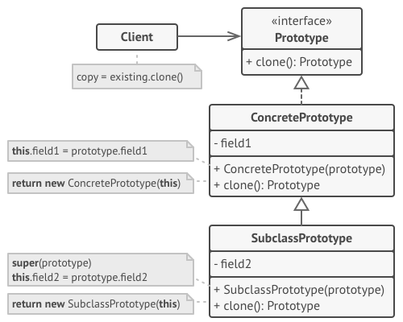
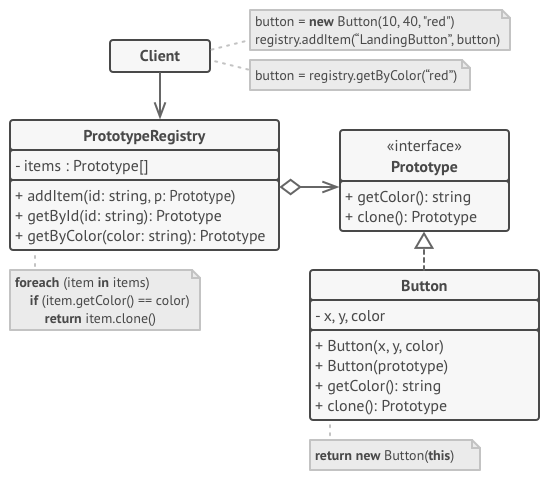

# Protoype

Prototype is a creational design pattern that lets you copy existing objects without making your code dependent on their classes.

**Complexity:** ★☆☆

**Popularity:** ★★☆

## Structure

### Basic implementation

1. The **Prototype** interface declares the cloning methods. In most cases, it’s a single `clone` method.
2. The **Concrete Prototype** class implements the cloning method. In addition to copying the original object’s data to the clone, this method may also handle some edge cases of the cloning process related to cloning linked objects, untangling recursive dependencies, etc.
3. The **Client** can produce a copy of any object that follows the prototype interface.

### Prototype registry implementation

The **Prototype Registry** provides an easy way to access frequently-used prototypes. It stores a set of pre-built objects that are ready to be copied. The simplest prototype registry is a `name → prototype` hash map. However, if you need better search criteria than a simple name, you can build a much more robust version of the registry.

## Applicability

1. Use the Prototype pattern when your code shouldn’t depend on the concrete classes of objects that you need to copy.
   
    This happens a lot when your code works with objects passed to you from 3rd-party code via some interface. The concrete classes of these objects are unknown, and you couldn’t depend on them even if you wanted to.

    The Prototype pattern provides the client code with a general interface for working with all objects that support cloning. This interface makes the client code independent from the concrete classes of objects that it clones.

1. Use the pattern when you want to reduce the number of subclasses that only differ in the way they initialize their respective objects.

    Suppose you have a complex class that requires a laborious configuration before it can be used. There are several common ways to configure this class, and this code is scattered through your app. To reduce the duplication, you create several subclasses and put every common configuration code into their constructors. You solved the duplication problem, but now you have lots of dummy subclasses.

    The Prototype pattern lets you use a set of pre-built objects configured in various ways as prototypes. Instead of instantiating a subclass that matches some configuration, the client can simply look for an appropriate prototype and clone it.

## Pros and Cons

| Pros                                                                                               | Cons                                                                        |
|----------------------------------------------------------------------------------------------------|-----------------------------------------------------------------------------|
| You can clone objects without coupling to their concrete classes.                                  | Cloning complex objects that have circular references might be very tricky. |
| You can get rid of repeated initialization code in favor of cloning pre-built prototypes.          |                                                                             |
| You can produce complex objects more conveniently.                                                 |                                                                             |
| You get an alternative to inheritance when dealing with configuration presets for complex objects. |                                                                             |