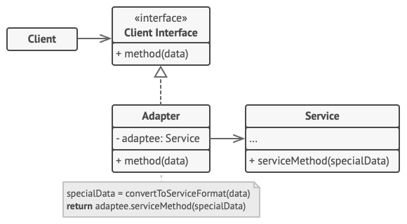

# Adapter

Adapter is a structural design pattern that allows objects with incompatible interfaces to collaborate.

**Complexity:** ★☆☆

**Popularity:** ★★★

## Structure

### Object adapter

This implementation uses the object composition principle: the adapter implements the interface of one object and wraps the other one. It can be implemented in all popular programming languages.

1. The **Client** is a class that contains the existing business logic of the program.
2. The **Client Interface** describes a protocol that other classes must follow to be able to collaborate with the client code.
3. The **Service** is some useful class (usually 3rd-party or legacy). The client can’t use this class directly because it has an incompatible interface.
4. The **Adapter** is a class that’s able to work with both the client and the service: it implements the client interface, while wrapping the service object. The adapter receives calls from the client via the client interface and translates them into calls to the wrapped service object in a format it can understand.
5. The client code doesn’t get coupled to the concrete adapter class as long as it works with the adapter via the client interface. Thanks to this, you can introduce new types of adapters into the program without breaking the existing client code. This can be useful when the interface of the service class gets changed or replaced: you can just create a new adapter class without changing the client code.

### Class adapter

This implementation uses inheritance: the adapter inherits interfaces from both objects at the same time. Note that this approach can only be implemented in programming languages that support multiple inheritance, such as C++.

The **Class Adapter** doesn’t need to wrap any objects because it inherits behaviors from both the client and the service. The adaptation happens within the overridden methods. The resulting adapter can be used in place of an existing client class.

## Applicability

1. **Use the Adapter class when you want to use some existing class, but its interface isn’t compatible with the rest of your code.**
   
    The Adapter pattern lets you create a middle-layer class that serves as a translator between your code and a legacy class, a 3rd-party class or any other class with a weird interface.

2. **Use the pattern when you want to reuse several existing subclasses that lack some common functionality that can’t be added to the superclass.**

    You could extend each subclass and put the missing functionality into new child classes. However, you’ll need to duplicate the code across all of these new classes, which smells really bad.

    The much more elegant solution would be to put the missing functionality into an adapter class. Then you would wrap objects with missing features inside the adapter, gaining needed features dynamically. For this to work, the target classes must have a common interface, and the adapter’s field should follow that interface. This approach looks very similar to the Decorator pattern.

## Pros & Cons

| Pros                                                                                                                                                                                              | Cons                                                                                                                                                                                                              |
| ------------------------------------------------------------------------------------------------------------------------------------------------------------------------------------------------- | ----------------------------------------------------------------------------------------------------------------------------------------------------------------------------------------------------------------- |
| *Single Responsibility Principle*. You can separate the interface or data conversion code from the primary business logic of the program.                                                         | The overall complexity of the code increases because you need to introduce a set of new interfaces and classes. Sometimes it’s simpler just to change the service class so that it matches the rest of your code. |
| *Open/Closed Principle*. You can introduce new types of adapters into the program without breaking the existing client code, as long as they work with the adapters through the client interface. |                                                                                                                                                                                                                   |