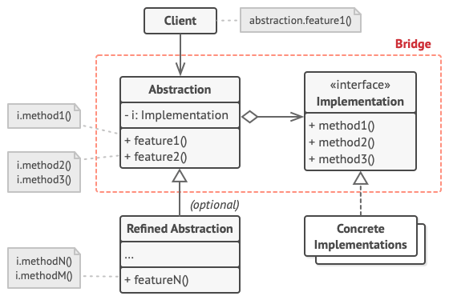

# Bridge

Bridge is a structural design pattern that lets you split a large class or a set of closely related classes into two separate hierarchies—abstraction and implementation—which can be developed independently of each other.

**Complexity:** ★★★

**Popularity:** ★☆☆

## Structure

1. The **Abstraction** provides high-level control logic. It relies on the implementation object to do the actual low-level work.
2. The **Implementation** declares the interface that’s common for all concrete implementations. An abstraction can only communicate with an implementation object via methods that are declared here.

    The abstraction may list the same methods as the implementation, but usually the abstraction declares some complex behaviors that rely on a wide variety of primitive operations declared by the implementation.

3. **Concrete Implementations** contain platform-specific code.
4. **Refined Abstractions** provide variants of control logic. Like their parent, they work with different implementations via the general implementation interface.
5. Usually, the **Client** is only interested in working with the abstraction. However, it’s the client’s job to link the abstraction object with one of the implementation objects.

## Applicability

1. Use the Bridge pattern when you want to divide and organize a monolithic class that has several variants of some functionality (for example, if the class can work with various database servers).

    The bigger a class becomes, the harder it is to figure out how it works, and the longer it takes to make a change. The changes made to one of the variations of functionality may require making changes across the whole class, which often results in making errors or not addressing some critical side effects.

    The Bridge pattern lets you split the monolithic class into several class hierarchies. After this, you can change the classes in each hierarchy independently of the classes in the others. This approach simplifies code maintenance and minimizes the risk of breaking existing code.

2. Use the pattern when you need to extend a class in several orthogonal (independent) dimensions.

    The Bridge suggests that you extract a separate class hierarchy for each of the dimensions. The original class delegates the related work to the objects belonging to those hierarchies instead of doing everything on its own.

3. Use the Bridge if you need to be able to switch implementations at runtime.

    Although it’s optional, the Bridge pattern lets you replace the implementation object inside the abstraction. It’s as easy as assigning a new value to a field.

    By the way, this last item is the main reason why so many people confuse the Bridge with the Strategy pattern. Remember that a pattern is more than just a certain way to structure your classes. It may also communicate intent and a problem being addressed.

## Pros & Cons

| Pros                                                                                                                                   | Cons                                                                                         |
| -------------------------------------------------------------------------------------------------------------------------------------- | -------------------------------------------------------------------------------------------- |
| You can create platform-independent classes and apps.                                                                                  | You might make the code more complicated by applying the pattern to a highly cohesive class. |
| The client code works with high-level abstractions. It isn’t exposed to the platform details.                                          |                                                                                              |
| *Open/Closed Principle*. You can introduce new abstractions and implementations independently from each other.                         |                                                                                              |
| *Single Responsibility Principle*. You can focus on high-level logic in the abstraction and on platform details in the implementation. |                                                                                              |