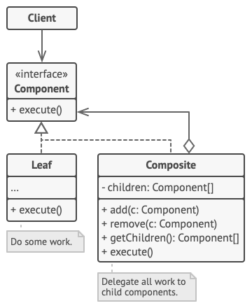

# Composite (Object Tree)

**Composite** is a structural design pattern that lets you compose objects into tree structures and then work with these structures as if they were individual objects.

**Complexity:** ★★☆

**Popularity:** ★★☆

## Structure

1. The Component interface describes operations that are common to both simple and complex elements of the tree.
2. The Leaf is a basic element of a tree that doesn’t have sub-elements. 

    Usually, leaf components end up doing most of the real work, since they don’t have anyone to delegate the work to.

3. The Container (aka composite) is an element that has sub-elements: leaves or other containers. A container doesn’t know the concrete classes of its children. It works with all sub-elements only via the component interface.

    Upon receiving a request, a container delegates the work to its sub-elements, processes intermediate results and then returns the final result to the client.

4. The Client works with all elements through the component interface. As a result, the client can work in the same way with both simple or complex elements of the tree.

## Applicability

1. Use the Composite pattern when you have to implement a tree-like object structure.

    The Composite pattern provides you with two basic element types that share a common interface: simple leaves and complex containers. A container can be composed of both leaves and other containers. This lets you construct a nested recursive object structure that resembles a tree.

2. Use the pattern when you want the client code to treat both simple and complex elements uniformly.

    All elements defined by the Composite pattern share a common interface. Using this interface, the client doesn’t have to worry about the concrete class of the objects it works with.

## Pros & Cons

| Pros                                                                                                           | Cons                                                                                                                                                                                                              |
| -------------------------------------------------------------------------------------------------------------- | ----------------------------------------------------------------------------------------------------------------------------------------------------------------------------------------------------------------- |
| You can work with complex tree structures more conveniently: use polymorphism and recursion to your advantage. | It might be difficult to provide a common interface for classes whose functionality differs too much. In certain scenarios, you’d need to overgeneralize the component interface, making it harder to comprehend. |
| *                                                                                                              | Open/Closed Principle*. You can introduce new element types into the app without breaking the existing code, which now works with the object tree.                                                                |  |