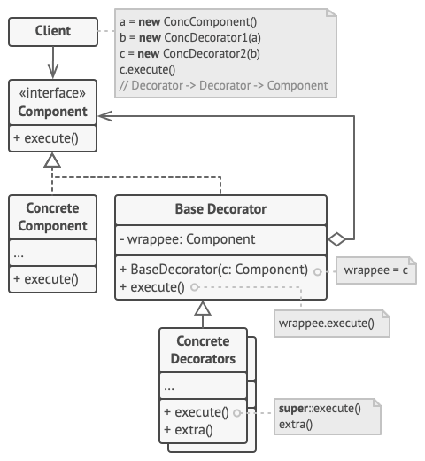

# Decorator (Wrapper)

Decorator is a structural design pattern that lets you attach new behaviors to objects by placing these objects inside special wrapper objects that contain the behaviors.

**Complexity:** ★★☆

**Popularity:** ★★☆

## Structure

1. The Component declares the common interface for both wrappers and wrapped objects.
2. Concrete Component is a class of objects being wrapped. It defines the basic behavior, which can be altered by decorators.
3. The Base Decorator class has a field for referencing a wrapped object. The field’s type should be declared as the component interface so it can contain both concrete components and decorators. The base decorator delegates all operations to the wrapped object.
4. Concrete Decorators define extra behaviors that can be added to components dynamically. Concrete decorators override methods of the base decorator and execute their behavior either before or after calling the parent method.
5. The Client can wrap components in multiple layers of decorators, as long as it works with all objects via the component interface.

## Applicability

1. **Use the Decorator pattern when you need to be able to assign extra behaviors to objects at runtime without breaking the code that uses these objects.**

    The Decorator lets you structure your business logic into layers, create a decorator for each layer and compose objects with various combinations of this logic at runtime. The client code can treat all these objects in the same way, since they all follow a common interface.

2. **Use the pattern when it’s awkward or not possible to extend an object’s behavior using inheritance.**

    Many programming languages have the final keyword that can be used to prevent further extension of a class. For a final class, the only way to reuse the existing behavior would be to wrap the class with your own wrapper, using the Decorator pattern.

## Pros & Cons

| Pros                                                                                                                                                  | Cons                                                                                                                    |
| ----------------------------------------------------------------------------------------------------------------------------------------------------- | ----------------------------------------------------------------------------------------------------------------------- |
| You can extend an object’s behavior without making a new subclass.                                                                                    | It’s hard to remove a specific wrapper from the wrappers stack.                                                         |
| You can add or remove responsibilities from an object at runtime.                                                                                     | It’s hard to implement a decorator in such a way that its behavior doesn’t depend on the order in the decorators stack. |
| You can combine several behaviors by wrapping an object into multiple decorators.                                                                     | The initial configuration code of layers might look pretty ugly.                                                        |
| *Single Responsibility Principle*. You can divide a monolithic class that implements many possible variants of behavior into several smaller classes. |                                                                                                                         |