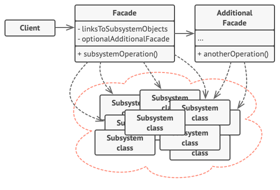

# Facade

Facade is a structural design pattern that provides a simplified interface to a library, a framework, or any other complex set of classes.

**Complexity:** ★☆☆

**Popularity:** ★★☆

## Structure

1. The Facade provides convenient access to a particular part of the subsystem’s functionality. It knows where to direct the client’s request and how to operate all the moving parts.
2. An Additional Facade class can be created to prevent polluting a single facade with unrelated features that might make it yet another complex structure. Additional facades can be used by both clients and other facades.
3. The Complex Subsystem consists of dozens of various objects. To make them all do something meaningful, you have to dive deep into the subsystem’s implementation details, such as initializing objects in the correct order and supplying them with data in the proper format.

    Subsystem classes aren’t aware of the facade’s existence. They operate within the system and work with each other directly.

4. The Client uses the facade instead of calling the subsystem objects directly.

## Applicability

1. **Use the Facade pattern when you need to have a limited but straightforward interface to a complex subsystem.**

    Often, subsystems get more complex over time. Even applying design patterns typically leads to creating more classes. A subsystem may become more flexible and easier to reuse in various contexts, but the amount of configuration and boilerplate code it demands from a client grows ever larger. The Facade attempts to fix this problem by providing a shortcut to the most-used features of the subsystem which fit most client requirements.

2. **Use the Facade when you want to structure a subsystem into layers.**

    Create facades to define entry points to each level of a subsystem. You can reduce coupling between multiple subsystems by requiring them to communicate only through facades.

    For example, let’s return to our video conversion framework. It can be broken down into two layers: video- and audio-related. For each layer, you can create a facade and then make the classes of each layer communicate with each other via those facades. This approach looks very similar to the Mediator pattern.

## Pros & Cons

| Pros                                                          | Cons                                                               |
| ------------------------------------------------------------- | ------------------------------------------------------------------ |
| You can isolate your code from the complexity of a subsystem. | A facade can become a god object coupled to all classes of an app. |