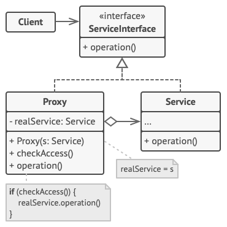

# Proxy

Proxy is a structural design pattern that lets you provide a substitute or placeholder for another object. A proxy controls access to the original object, allowing you to perform something either before or after the request gets through to the original object.

## Structure

1. The Service Interface declares the interface of the Service. The proxy must follow this interface to be able to disguise itself as a service object.
2. The Service is a class that provides some useful business logic.
3. The Proxy class has a reference field that points to a service object. After the proxy finishes its processing (e.g., lazy initialization, logging, access control, caching, etc.), it passes the request to the service object.

    Usually, proxies manage the full lifecycle of their service objects.

4. The Client should work with both services and proxies via the same interface. This way you can pass a proxy into any code that expects a service object.

## Applicability

There are dozens of ways to utilize the Proxy pattern. Let’s go over the most popular uses.

1. **Lazy initialization (virtual proxy). This is when you have a heavyweight service object that wastes system resources by being always up, even though you only need it from time to time.**

    Instead of creating the object when the app launches, you can delay the object’s initialization to a time when it’s really needed.

2. **Access control (protection proxy). This is when you want only specific clients to be able to use the service object; for instance, when your objects are crucial parts of an operating system and clients are various launched applications (including malicious ones).**

    The proxy can pass the request to the service object only if the client’s credentials match some criteria.

3. **Local execution of a remote service (remote proxy). This is when the service object is located on a remote server.**

    In this case, the proxy passes the client request over the network, handling all of the nasty details of working with the network.

4. **Logging requests (logging proxy). This is when you want to keep a history of requests to the service object.**

    The proxy can log each request before passing it to the service.

5. **Caching request results (caching proxy). This is when you need to cache results of client requests and manage the life cycle of this cache, especially if results are quite large.**

    The proxy can implement caching for recurring requests that always yield the same results. The proxy may use the parameters of requests as the cache keys.

6. **Smart reference. This is when you need to be able to dismiss a heavyweight object once there are no clients that use it.**

    The proxy can keep track of clients that obtained a reference to the service object or its results. From time to time, the proxy may go over the clients and check whether they are still active. If the client list gets empty, the proxy might dismiss the service object and free the underlying system resources.

    The proxy can also track whether the client had modified the service object. Then the unchanged objects may be reused by other clients.

## Pros & Cons

| Pros                                                                                            | Cons                                                                                   |
| ----------------------------------------------------------------------------------------------- | -------------------------------------------------------------------------------------- |
| You can control the service object without clients knowing about it.                            | The code may become more complicated since you need to introduce a lot of new classes. |
| You can manage the lifecycle of the service object when clients don’t care about it.            | The response from the service might get delayed.                                       |
| The proxy works even if the service object isn’t ready or is not available.                     |                                                                                        |
| *Open/Closed Principle*. You can introduce new proxies without changing the service or clients. |                                                                                        |